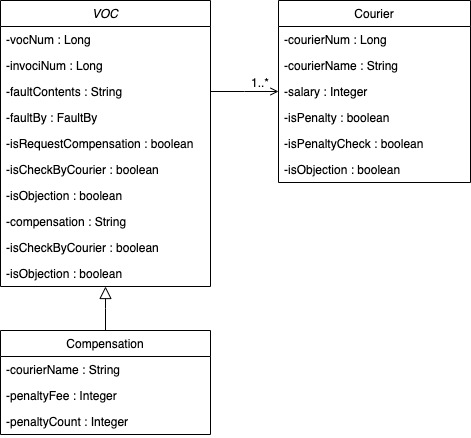
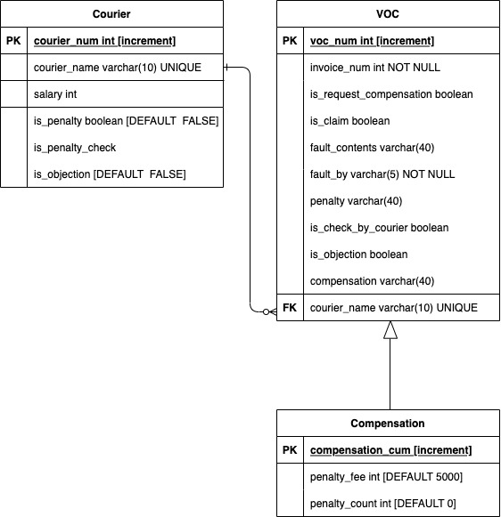

# 🔅Third Party Logistics
### 사용 기술
* Spring Boot
* Java 8
* Thymeleaf
* lombok

### 개요
* MVC 패턴을 이용하여 레이어 설계
  * VOC / 배상(Compensation) / 운송자(Courier) 세 영역으로 분리하여 프로젝트를 구성 함.
  * HTTP 요청을 Controller가 mapping 하여 해당 요청을 비즈니스 로직에 맞게 처리하도록 Service 레이어에 전달하고 Service 레이어에서 Repository로 전달하여 변경사항을 저장하였음(DB는 아직 선정되지 않았다고 가정)
  * 요청이 모두 처리되면 해당 결과를 view로 반환하여 사용자에게 전달

### Class Diagram

### DB 스키마

### 개선사항
* VOC 정보와 부모 정보의 상속 관계 개선 
* 테스트 코드 추가
* 예외처리 추가
* 검증 추가